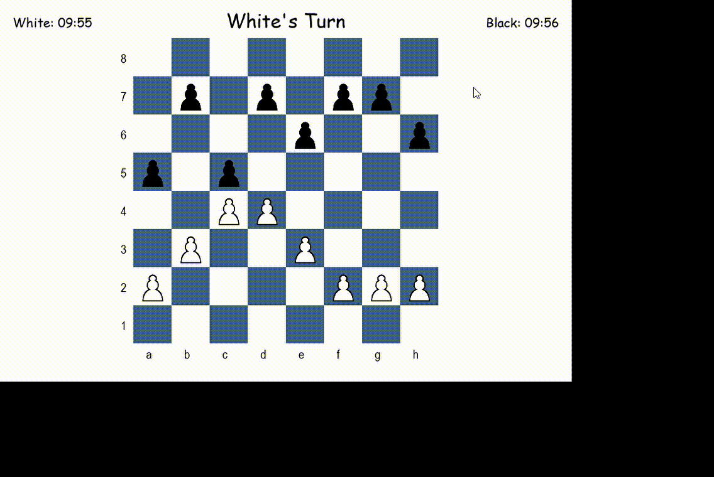
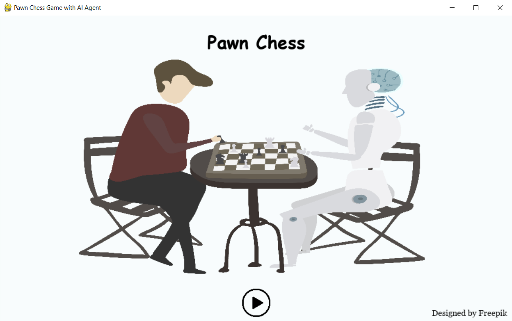
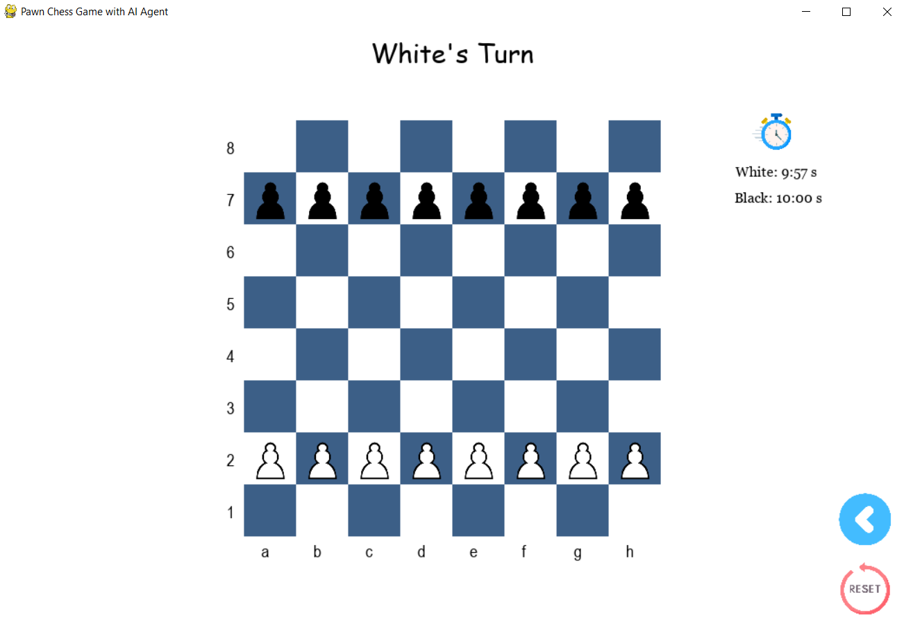
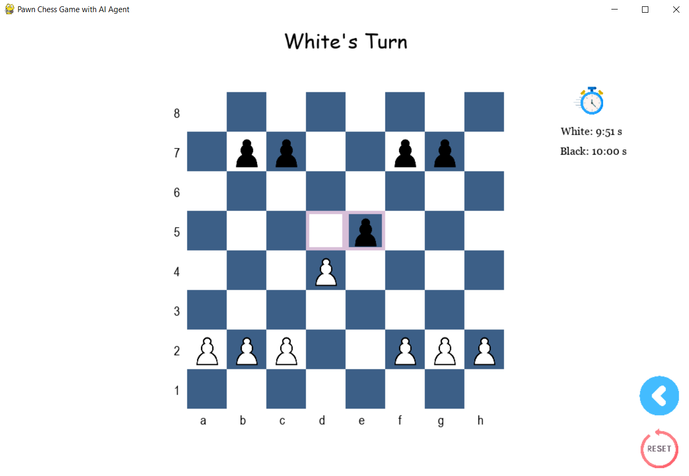
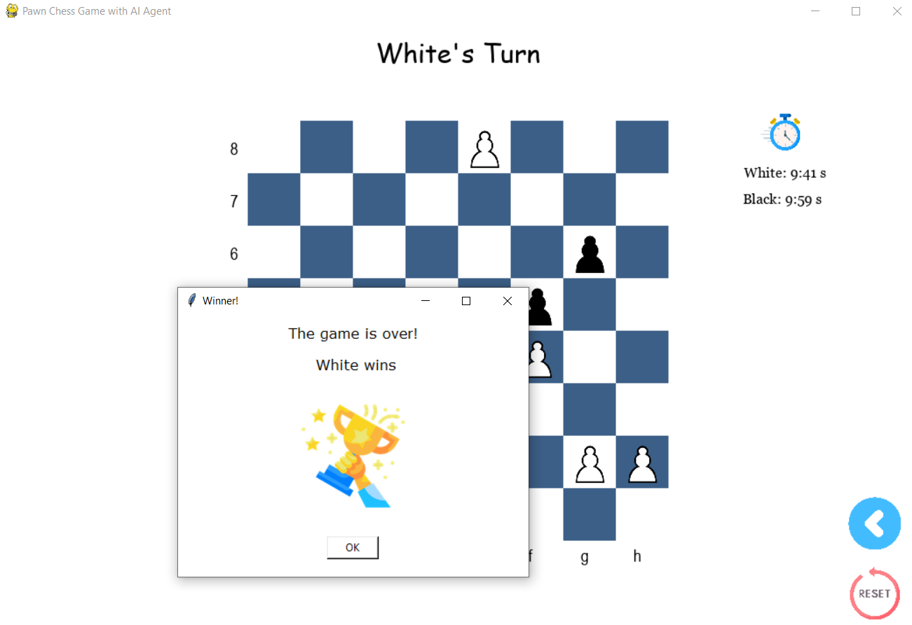

# ♟️ Pawn Game

---

 🎯 This Python project, developed with the Pygame module for the graphical user interface (GUI), implements an AI agent for a pawn chess game. The AI utilizes the Minimax algorithm with Alpha-Beta pruning to make strategic decisions. It dynamically adjusts its search depth depending on time constraints and incorporates heuristic evaluations to ensure efficient, competitive gameplay.



##### 🎮 Game Description:

The game is played between two players -White and Black- on an 8x8 chessboard.

* White goes first.
* Each player starts with 8 pawns, placed on the second row for White and the seventh row for Black.
* Players alternate turns, moving one pawn per turn.

The movement rules for pawns are as follows:

* Pawns move **one square forward**.
* Pawns can **capture an opponent's pawn diagonally**.
* A pawn **cannot move forward** if an opponent's pawn blocks the adjacent square.
* **In the opening**, pawns can move **two squares forward** if both squares are empty.
* If an opponent's pawn is on an adjacent horizontal square and a pawn moves two squares forward, the opponent may capture it as if the pawn only moved one square (this rule is valid only for the next move – known as "en passant").

##### **🏆 Winning Conditions:**

The game is won if one of the following conditions occurs:

* A player successfully moves a pawn to the last row.
* A player successfully captures all of the opponent's pawns.
* A player causes a situation where the opponent has no legal moves left.

##### Installation:

Download the repository and install the necessary Python module:

`pip install pygame `

##### 🚀 Running the Pawn Game:

This project offers two gameplay modes:

1. **Main Function Mode:**
   - In this stand-alone mode, the player controls one side of the chessboard, while the AI automatically computes its moves on the other side.
2. **Server-Client Mode:**
   - In this mode, the game is played through a server-client interaction and supports two configurations:
     * **User vs AI:** The user plays one side, and the AI plays the other.
     * **AI vs AI:** Both sides are controlled by AI agents, enabling automated gameplay between two AIs.

**Running the Game in Server-Client Mode:**

    **a.** Start the Server:

* Open a terminal and run the following command to start the server:

```
 python server.py
```

   **b.** Start the AI Client (Playing as White):

- Open another terminal window and run the following command for the AI client:

```
 python client.py
```

    **c.** Start the User Client (Playing as Black):

* In third terminal window, run the following command for the user client:

```
 python humanClient.py
```

- Alternatively, you can run another `client.py` to play as the AI-controlled player on the Black side.

##### 🖼️ Game Screen:

* **Main Game Screen:**



* **Starting position:**



* **Player Move Options:**



* **Game End screen - Game Over:**

  
